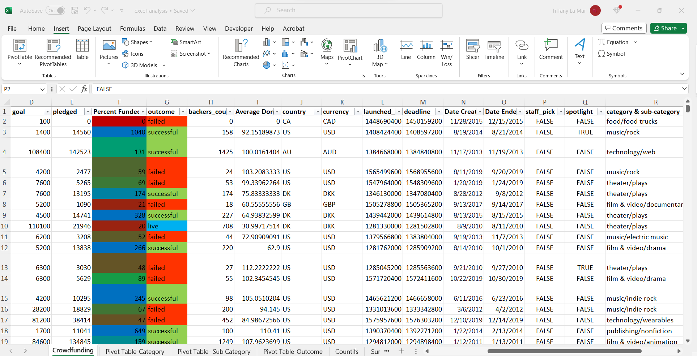

# Excel-Analysis

## Website: 
[website](tiffanylamar1@gmail.com)

## Description
Analysis Trying to Find Trends in Success and Fails

## Table of Contents

- [Installation](#installation)
- [Usage](#usage)
- [Credits](#credits)

- [Features](#features)

- [Contact](#contact)

## Installation
excel

## Usage
open excel file of the analysis

## Credits
Tiffany La Mar

## Features
Provides trend analysis

### Given the provided data, what are three conclusions that we can draw about crowdfunding campaigns?
1. Base on the data provided, we can conclude that ‘Plays’ and ‘Theatre’ are the most popular sources from backers for the crowdfunding, however, although there was a high success rate, there was almost an equal amount of failed rate: 132 failed, 187 successes.

2. The highest success rate occurs in the summer months of June and July then plummets in August. The failure rate increases in June and reaches one of its highest peaks in August. 

3. All goals of 100 either failed or cancelled. All with goal of 197,600 failed, however, they each had a percentage funded of 42% or higher as oppose to the 100 goal having 5% being the highest percentage funded

### What are some limitations of this dataset?
1.	Potential reasons as to why an event may have been cancelled or unsuccessful (i.e. emergency, payment issues).

2.  Not knowing whether the name provided is for an individual or business/company.

### What are some other possible tables and/or graphs that we could create, and what additional value would they provide?
A Bar graph comparing the individual country’s success/failure rates per category could be useful in order to determine in the future what more of the marketing for the crowdfunding should be directed towards in relations to the country. 

## Contact
If there are any questions of concerns, I can be reached at:
##### [github: teelam1910](https://github.com/teelam1910)
##### [email: tiffanylamar1@gmail.com](mailto:tiffanylamar1@gmail.com)
